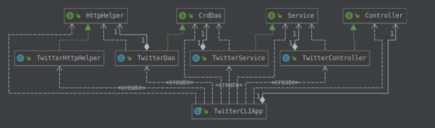

# Introduction
The Java Twitter App is a command line application that demonstrates the use of Creating, Reading and Deleting Tweets. It connects to Twitter REST API using the authentication tool OAuth 1.0. Post and Get requests were used with the twitter API, and the data was processed using the DAO design pattern. I learned how to use the Model-View-Controller design architecture (minus the "View" bit), how to implement and test an app using a modular approach, and how to manage dependencies. I also learned a use case for Spring, as we eventually implemented the app with Springboot.

# Design


## TwitterHttpHelper
This class is part of the DAO layer, and is a dependency for the TwitterDAO class. It's function is to execute HTTP requests. It implements `HttpHelper` interface.
## TwitterDao
This class is also part of the DAO layer, and its purpose is to construct the URI's for the TwitterHTTPHelper and process HTTP responses. It implements `CrdDao` interface. 
## TwitterService
This class is part of the service layer. The function of TwitterServer is to handle the business logic. In this instance, it validate the input such as tweet length and validity of coordinates, or the Tweet id. and it invokes methods defined in TwitterDao if the input is in the correct format. It implements `Service` interface.
## TwitterController
This class is part of the controller layer.
The function of TwitterController is to validate the input from the user to ensure the correct number of arguments have been sent, and that they are not empty. , convert the input to the correct data type and then invoke the methods defined in the TwitterService. It implements `Controller` interface
## TwitterCLIApp
This class is part of the application layer. It parses the user input and calls the corresponding method in TwitterController. It also sets up dependencies and environment variables.

# Quick Start
This app requires you to have a twitter dev account setup. The credentials 
```
CONSUMER_KEY
CONSUMER_SECRET
ACCESS_TOKEN
TOKEN_SECRET 
```
need to be setup as environmental variables either by adding them to the .bashrc file, or exporting them manually each time you start a new terminal instance. The application can be run through an IDE where maven can be taken care of, or you can navigate to the twitter folder, and package the project by running mvn package, which will build a .jar file. Then you can run:
`java -jar target/ java_apps-1.0.0-SNAPSHOT.jar [action] [option]`, where action and option are demonstrated below:

#### Post a Tweet
Usage: `TwitterCLIApp post "Text" "Longitude:Latitude"`

#### Show a Tweet
Usage: `TwitterCLIApp show "id"`

#### Delete Tweet(s)
Usage: `TwitterCLIApp delete "ids"` where"ids" is a string that stores a list of ids separated by commas

# Model

The Tweet model in this project is a simplified version of the full Tweet model. We implemented Coordinates, Entities, Hashtags, and UserMentions objects as part of thisTweet object. Below is an example of the simplified Tweet Object.
//Simplified Tweet Object 
```
{ "created_at":"Mon Feb 18 21:24:39 +0000 2019", 
"id":1097607853932564480, 
"id_str":"1097607853932564480", 
"text":"test with loc223", 
"entities":{ 
"hashtags":[], 
"user_mentions":[] 
}, 
"coordinates":null, 
"retweet_count":0, 
"favorite_count":0, 
"favorited":false, 
"retweeted":false 
}
```
# Improvements
1. Add the ability to schedule tweets for posting at a later time. Influencers and businesses would love this functionality.
2. Implement the fields option in show command so that user can specify which fields he wants to see in the output.
3. Implement ways to see multiple tweets at once, and see all tweets for a particular user for a specified time period.
