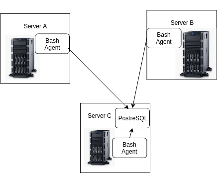

## Introduction
The Linux Cluster Administration (LCA) team manages a Linux cluster of 10 nodes/servers which are running CentOS 7. These servers are internally connected through a switch and able to communicate through internal IPv4 addresses.

The LCA team needs to record the hardware specifications of each node and monitor node resource usages (e.g. CPU/Memory) in realtime. Cluster Monitor Agent is an internal tool that monitors the cluster resources. The collected data is stored in an RDBMS database. LCA team will use the data to generate some reports for future resource planning purposes (e.g. add/remove servers).

## Tables
There are two tables, host_info and host_usage. host_info is for hardware specifications of each connected node while host_usage contains almost real time resource usage information (updated every minute).

## host_info

* id: The primary key for host_info that correspondes to each node. Set to auto-increment. This MVP only has one node
* hostname: The name of the node, has a unique constraint
* cpu_number: The number of cores in the CPU
* cpu_architecture: The CPU's architecture type
* cpu_model: Manufacturer and designation of the CPU
* cpu_mhz: CPU speed in megahertz
* L2_cache: Size of the L2 cache in kB
* total_mem: Total amount of memory on the system in kB
* timestamp: UTC timestamp in yyyy-mm-dd hh:mm:ss of when the node hardware specifcations were collected

## host_usage

* timestamp: UTC timestamp in yyyy-mm-dd hh:mm:ss of which minute node resource usage information was collected
* host_id: A foreign key to the id value in host_info table
* memory_free: Amount of free memory measured in MB
* cpu_idle: Percentage of total CPU time spent idle
* cpu_kernel: Percentage of total CPU time spent running kernel/system code
* disk_io: Number of current disk I/O operations in progress
* disk_available: Amount of disk space available MB

## Usage

1) Run "./scripts/psql_docker.sh start" once to start the database with docker. Then run the ddl.sql file once to initialize the database tables
2) `host_info.sh` collects the host hardware info and inserts it into the database. It will be run only once at the installation time
3) `host_usage.sh` collects the current host usage (CPU and Memory) and then inserts into the database. It will be triggered by the crontab job every minute
4) crontab is setup to run once every minute

## Improvements 

1) Improve not having duplicate code by using functions in my script files
2) Automate some more of the setting up process by adding in an extra bash script
3) Add scripts for graphs that show usage over time

