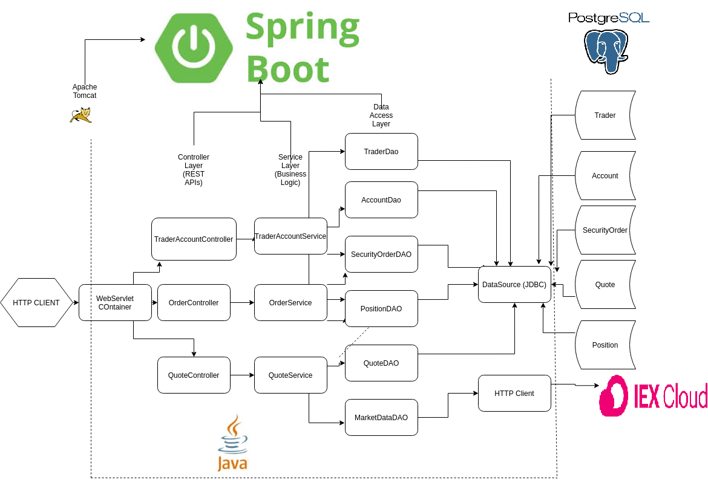
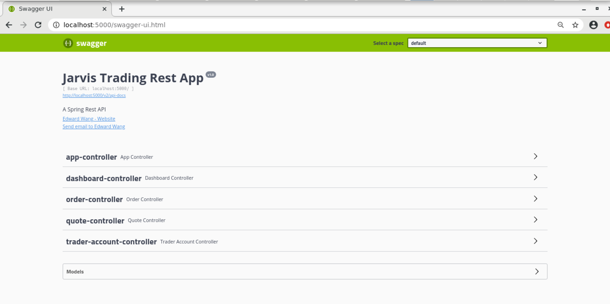

Table of contents
* [Introduction](#introduction)
* [Quick Start](#quick-start)
* [Architecture](#architecture)
* [REST API usage](#rest-api-usage)
* [Docker Deployment](#docker-deployment)
* [Improvements](#improvements)

# Introduction
This project is a proof of concept of an online stock trading simulation REST API. Its a MicroService which is implemented with Springboot for internal dependency management, and Maven for 
external dependency management. The users of this application can get market quotes for stock tickers, details about user data, 
positions, and sercurity orders, all of which are stored in the Postgres SQL database. Each order is associated with an account and 
trader, both of can be created through the app. All of the data relating to quotes comes from IEX Cloud in real time, and the app
is deployed using Docker. 

# Quick Start
- Prerequisites: Docker, CentOS 7, JDK version 1.8, IEX cloud account, Maven, Swagger

Ensure docker is running:
```
systemctl status docker || systemctl start docker
```


Build both the PSQL and Trading application docker images and verify their existence:


At the root directory of this repository, build an image for Postgres SQL database:
```
cd ./springboot/psql 
docker build -t trading-psql .
docker image ls -f reference=trading-psql
```
At the root directory of this repository,  build an image for this application:
```
cd ./springboot/
docker build -t trading-app . 
docker image ls -f reference=trading-app
```

Create the docker network to allow communication between the two containers and and verify it exists:

```
docker network create --driver bridge trading-net
docker network ls
```
Start the containers
```
#Set your environmental variables
export PSQL_URL="your psql URL"
export PSQL_USER="your username"
export PSQL_PASSWORD="your password"
export IEX_PUB_TOKEN="your_token"

#start psql container
docker run --name trading-psql-dev \
-e POSTGRES_PASSWORD='$PSQL_PASSWORD' \
-e POSTGRES_DB=jrvstrading \
-e POSTGRES_USER='$PSQL_USERNAME' \
--network trading-net \
-d -p 5432:5432 trading-psql

#start app container
docker run --name trading-app-dev \
-e "PSQL_URL=${PSQL_URL}" \
-e "PSQL_USER=${PSQL_USER}" \
-e "PSQL_PASSWORD=${PSQL_PASSWORD}" \
-e "IEX_PUB_TOKEN=${IEX_PUB_TOKEN}" \
--network trading-net \
-p 5000:5000 -t trading-app
```
list running containers, you should see two running docker containers
```
docker container ls
```
- Try trading-app with SwaggerUI (screenshot)

# Architecture
The diagram below shows the 3 tiers of the application: client tier, application tier, and database tier. These are called microservices in contrast to a monolithic application.


  - *Controller layer*: This layer recieves mapped HTTP requests from the servlet, and invokes the corresponsing method in the service layer. In other words, the controller layer is used to parse user input and direct the data to the appropriate services. These individual controllers are descibed in more detail in a later section.
  
  - *Service layer*: This performs the business logic of the application. They recieve input from the controller layers, and output to the various DAO layers if necessary. The layer performs checks such as making sure a trader has a position before allowing to sell the position.
 
   - *DAO layer*: This layer is used to communicate with external sources including databases or other APIs. The DAO has a  responsibility to insert, find, update or delete rows in the PSQL database. Moreover, it will also be able to pull market data from the IEX cloud. DAO layer ensures that the service layer is responsible only for business logic and not for communication with external sources. This provides the separation of concerns that make API more robust and scalable.
   
  - *Web Servlet*: The webservlet provided by the Springboot framework is used to map HTTP requets from the client to the controller.


# REST API Usage
## Swagger
Swagger is an open-source software framework backed by a large ecosystem of tools that helps developers design, build, document, and consume RESTful web services. Swagger opens up the ability to interact with these systems to a wider demographic, including those who have little to no technical training. 


## Quote Controller

  - GET `/quote/dailyList`: list all securities that are currently stored in the database. 
  
__GET__ `/quote/iex/ticker/{ticker}`
- This endpoint will get the most recent market data using the latest IEX Cloud market information.

__POST__ `/quote/tickerID/{tickerId}`
- This endpoint will get the most recent market data using the latest IEX Cloud market information and save it to the database.

__PUT__ `/quote/iexMarketData`
- This endpoint will pull the most recent market data from the IEX cloud for every quote that exists in the database. It will only update the quotes that are currently in the database instead of creating new ones.

__PUT__ `/quote/update` Update a particular quote.

## Trader Controller
In this endpoint, user input is parsed and used to create new trading accounts, make deposits or withdrawals and delete trading accounts.

__DELETE__ `/trader/traderId/{traderId}`
- This endpoint will delete a trader and the account associated with that trader by the given id. If the fund balance is not 0 or this trader is still holding securities, it will return an exception.

__POST__ `/trader`
- This endpoint will use the trader information in the HTTP body to create a trader and an associated account. All fields except the ID field should not be null. The user gets back a TraderAccountView which contains both trader record and account record for the newly created trader.

__POST__`/trader/firstname/{firstname}/lastname/{lastname}/dob/{dob}/country/{country}/email/{email}`
- This endpoint will do the same thing as the above endpoint. However, the information of the trader is included in the endpoint URL instead of the HTTP request header. A default balance of $0 is created in the associated account.

__PUT__`/trader/deposit/traderId/{traderId}/amount/{amount}`
- This endpoint will deposit the specified amount of funds into the account specified by traderID and it will return the new account object.

__PUT__`/trader/withdraw/traderId/{traderId}/amount/{amount}`
- This endpoint will deposit the specified amount of funds into the account specified by traderID and it will return the new account object.

## Order Controller
__POST__ `/order/marketOrder`
- This endpoint will submit a market order if there are sufficient funds or security, otherwise a bad HTTP status code will be returned. If the execution of the market order succeeds, it will return the executed security order.


# Docker Deployment
- docker diagram including images, containers, network, and docker hub
e.g. https://www.notion.so/jarviscanada/Dockerize-Trading-App-fc8c8f4167ad46089099fd0d31e3855d#6f8912f9438e4e61b91fe57f8ef896e0
- describe each image in details (e.g. how psql initialize tables)

# Improvements
-
